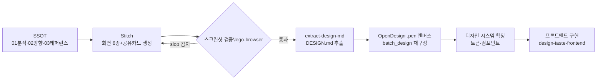

# 06 — 워크플로: Stitch MCP → OpenDesign (.pen)

> 목표: Pinterest·레퍼런스 SSOT(03/04) → Stitch로 화면 생성 → OpenDesign 캔버스에서 정제 → 디자인 시스템 확정 → 프론트엔드 인계.

## 0. 사전 조건 체크리스트

| 항목 | 상태 | 비고 |
|---|---|---|
| OpenDesign 앱 실행 | **실행 필요** | 2026-09-04 확인: 앱 미실행 시 pencil MCP `get_editor_state` → "failed to connect to running Pencil app" 오류 |
| Stitch 접속 | stitch.withgoogle.com (웹) 또는 Stitch MCP | MCP 경로: Antigravity 내 Stitch MCP(공식 codelab) 또는 커뮤니티 서버 `Kargatharaakash/stitch-mcp` |
| design-taste-frontend v2 | 설치 완료 (프로젝트 `.agents/skills/`) | |
| stitch-design 플러그인 | 설치 완료 (`~/.claude/skills/stitch-skills/plugins/`) | |
| ego-browser | 사용 가능 | 시각 검증 담당 |

## 1. 흐름도

## 2. 단계별 절차

### Step 1 — 방향 확정 (Stitch 이전, 사람이 결정)
- `02-direction/design-direction.md`의 3축(A Nocturne Editorial / B Hanji Modern / C Obang Hybrid) 중 베이스 선택.
- 판단 기준: 공유 카드 30% · 신뢰 25% · 확장성 25% · 차별성 20%.
- 초기 가설: A+C 하이브리드 (본문 읽기 모드만 B 요소).

### Step 2 — Stitch 프롬프트 생성
- `stitch-design/generate-design` 스킬의 `prompt-keywords.md`, `design-mappings.md` 참조.
- 프롬프트 구조 (화면당 1개):
  1. 제품 1줄 정의 (SSOT §1 문장 그대로)
  2. 화면 목적 + 필수 요소 (01-analysis §7 표)
  3. 방향 토큰 (02-direction의 색·타이포·무드 값)
  4. 금지 조항: fortune/destiny/fate 카피, 수정구·성운 그라데이션 남발, 이모지, 3열 카드 그리드 랜딩, indigo/violet 기본값
  5. 참조 무드: "editorial serif dark, Co-Star mood reinterpreted for Saju, hanji grain, obang accents"
- 모바일 프레임 우선 (웹=모바일 퍼스트).

### Step 3 — 생성 + 검증 루프
- Stitch 결과를 ego-browser로 캡처 (레퍼런스와 나란히 비교).
- 감사 기준: `design-taste-frontend` §14 pre-flight + `kill-ai-slop` 카탈로그.
- 각 화면이 SSOT 원리 P1–P7 통과하는지 `01-analysis` §5로 채점.

### Step 4 — OpenDesign 이관
- `extract-design-md` 스킬로 DESIGN.md 생성 → `02-direction/DESIGN.md` 저장.
- OpenDesign 앱 실행 확인 → pencil MCP `get_editor_state(include_schema=true)` → `get_guidelines` → `batch_design`으로 화면/컴포넌트 재구성.
- 캔버스에 레퍼런스 보드(03/04 에셋)를 참조 프레임으로 배치해 이후 반복 작업의 기준점 확보.

### Step 5 — 시스템 확정 → 인계
- 토큰(색 5+뉴트럴, 타입 스케일, 스페이싱, 반경, 모션) · 컴포넌트(물상 배지 10종, 공유카드, 컷 블록, 결제 보증 블록) 목록을 `.pen`에서 확정.
- 구현 착수 시 `design-taste-frontend` 로드 + 본 SSOT를 컨텍스트로 주입.

## 3. 결함 대응

| 증상 | 대응 |
|---|---|
| pencil MCP 연결 실패 | OpenDesign 앱 실행 후 재시도 (재시도 1회 제한) |
| Stitch MCP 미구성 | 웹 UI(stitch.withgoogle.com)에서 수동 생성 + ego-browser 캡처로 동일 검증 루프 |
| 생성물이 범용 미스틱으로 붕괴 | Step 2 프롬프트의 '금지 조항' 강화 + 03-references의 반례 이미지 첨부 |
